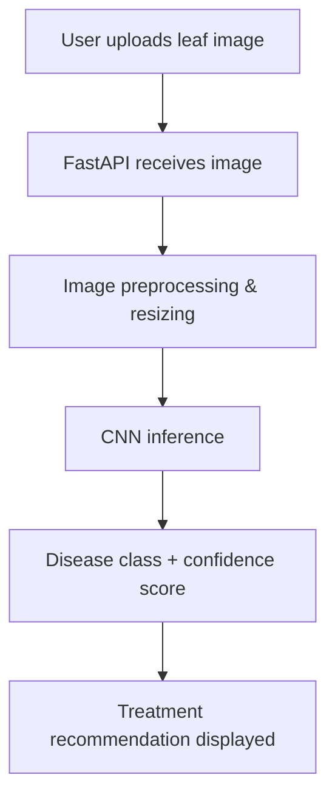

# 🌿 Crop Disease Detection Using CNN

A Deep Learning system that identifies crop diseases from leaf images using a custom Convolutional Neural Network, paired with a FastAPI web application for real-time inference and treatment recommendations.


---

## 📌 Overview

Early detection of crop disease can be the difference between a healthy harvest and a lost one. This project trains a custom CNN on the **New Plant Diseases Dataset** (an augmented version of PlantVillage) to classify leaf images into **38 disease/healthy categories across 14 crop species**, then serves predictions through a lightweight web app that also surfaces a treatment recommendation for the detected condition.

---

## ✨ Features

- 🔍 Disease prediction from an uploaded leaf image
- 📊 Confidence score returned with every prediction
- 💊 Treatment & care recommendations per diagnosis
- ⚡ FastAPI REST backend for inference
- 🖥️ Responsive HTML/CSS/JS frontend
- 🌱 Coverage across 14 crop species
- 🧠 Custom-trained CNN (not a pretrained/transfer-learning model)

---

## 🔄 How It Works



---

## 🖼️ Application Preview

**Home Page**


**Supported Plants**


**Upload & Prediction**


**Diagnosis & Treatment**


**About Page**


---

## 🧰 Tech Stack

| Layer | Technologies |
|---|---|
| **Model** | TensorFlow, Keras |
| **Backend** | FastAPI, NumPy, Pillow |
| **Frontend** | HTML, CSS, JavaScript |
| **Training Environment** | Google Colab (GPU: T4) |

---

## 📂 Dataset

- **Source:** New Plant Diseases Dataset (Kaggle) — an offline-augmented recreation of the original PlantVillage dataset
- **Size:** ~87,000 RGB images
- **Classes:** 38 (healthy + diseased leaves)
- **Crops:** 14 species
- **Split:** 80% training / 20% validation, preserving directory structure
- **Image size:** Resized to 256×256
- **Note:** Includes augmented images for better generalization; a separate 33-image test directory is used for holdout prediction checks

---

## 🧠 Model Development

**Pipeline:** raw images → resize to 256×256 → normalize (pixel values scaled to 0–1) → batch loading via Keras `ImageDataGenerator` → CNN inference → softmax classification over 38 classes.

**Architecture — Custom CNN (4 convolutional blocks):**

| Block | Layers |
|---|---|
| 1 | Conv2D (64 filters) → BatchNorm → MaxPooling → Dropout (0.3) |
| 2 | Conv2D (128 filters) → BatchNorm → MaxPooling → Dropout (0.4) |
| 3 | Conv2D (256 filters) → BatchNorm → MaxPooling → Dropout (0.4) |
| 4 | Conv2D (512 filters) → BatchNorm → MaxPooling → Dropout (0.4) |
| Head | Flatten → Dense (512, ReLU) → BatchNorm → Dropout (0.5) → Dense (38, Softmax) |

**Training configuration:**

| Setting | Value |
|---|---|
| Optimizer | Adam (learning rate = 0.0001) |
| Loss Function | Sparse Categorical Crossentropy |
| Epochs | 10 |
| Early Stopping | Monitors `val_loss`, patience = 3, restores best weights |
| ReduceLROnPlateau | Monitors `val_loss`, factor = 0.5, patience = 5 |

---

## 📈 Performance

| Metric | Dataset | Value |
|---|---|---|
| Accuracy | Train | 99.02% |
| Accuracy | Test | 94.64% |
| Precision | Test | 94.64% |
| Recall | Test | 94.64% |

| Detail | Value |
|---|---|
| Dataset | New Plant Diseases Dataset (PlantVillage, augmented) |
| Number of Images | ~87,000 |
| Number of Classes | 38 |
| Number of Crops | 14 |
| Framework | TensorFlow / Keras |
| Input Size | 256 × 256 × 3 |
| Model Type | Custom CNN |

---

## 🗂️ Repository Structure

```
Crop-Disease-Detection-Using-CNN/
├── app/
│   ├── main.py              # FastAPI application entry point
│   ├── requirements.txt     # Backend dependencies
│   ├── static/
│   │   ├── index.html       # Frontend markup
│   │   ├── style.css        # Styling
│   │   ├── script.js        # Upload & prediction logic
│   │   └── assets/          # Frontend images/icons
│   └── model/                # (Model downloaded separately — see below)
├── notebooks/                 # Data preprocessing, training, evaluation
├── README.md
├── LICENSE
└── .gitignore
```

---

## 💾 Model Storage

The trained model is approximately **355 MB**, which exceeds GitHub's recommended file size limits for version control. Rather than bloating the repository, the trained weights are hosted separately on **Hugging Face**:

🔗 **[anshikagupta-1/crop-disease-model](https://huggingface.co/anshikagupta-1/crop-disease-model)**

This keeps the GitHub repo lightweight and fast to clone, while still letting anyone download the trained model on demand.

---

## 🚀 Running Locally

```bash
# 1. Clone the repository
git clone https://github.com/<your-username>/Crop-Disease-Detection-Using-CNN.git
cd Crop-Disease-Detection-Using-CNN

# 2. Install dependencies
pip install -r app/requirements.txt

# 3. Download the trained model from Hugging Face
# https://huggingface.co/anshikagupta-1/crop-disease-model
# Place the downloaded model file inside app/model/

# 4. Run the FastAPI server
cd app
uvicorn main:app --reload

# 5. Open the frontend
# Navigate to http://127.0.0.1:8000 in your browser
```

---

## 📓 Notebook

The `notebooks/` folder contains the full model development workflow:

- Data preprocessing and augmentation
- CNN architecture definition
- Model training
- Evaluation (accuracy, precision, recall)
- Prediction experiments on holdout test images

---

## 🔮 Future Improvements

- [ ] TensorFlow Lite conversion for mobile/edge inference
- [ ] Docker containerization for easier deployment
- [ ] Cloud deployment (AWS/GCP/Azure)
- [ ] Explainable AI with Grad-CAM visualizations
- [ ] Native mobile application
- [ ] Support for additional crop species
- [ ] Improved UI/UX

---

## 👥 Authors

Built by **Anshika Gupta** and **Devang Solanki**.

